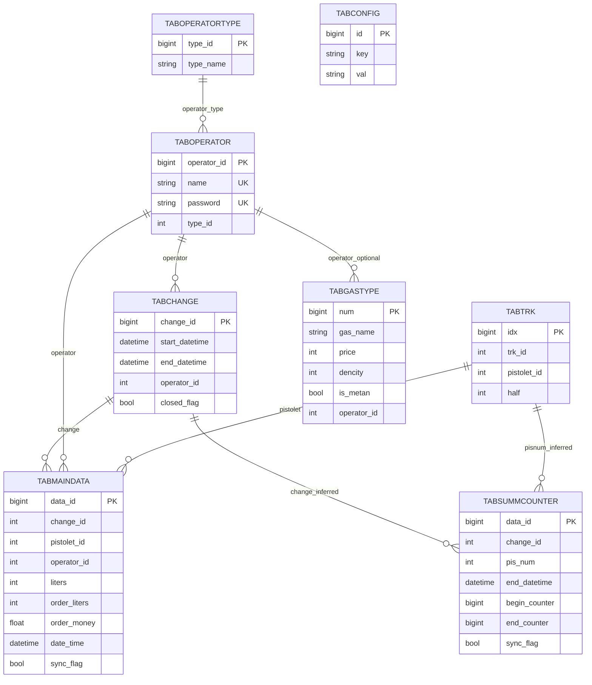

# MMS Bridge (`texnouz_copy` -> `mms_localhost`)

Bu loyiha local PostgreSQL bazadagi `public.tabmaindata` ma'lumotlarini remote serverdagi
`public.operation_operation_texnouz` jadvaliga uzluksiz sync qilish uchun yozilgan.

## 1) Baza Tuzilmasi (qisqacha)

Manba baza (`texnouz_copy`, `public` schema) asosiy jadvallari:

| Jadval | Vazifasi |
|---|---|
| `tabmaindata` | Asosiy tranzaksiya yozuvlari |
| `tabchange` | Smena ochilish/yopilish holatlari |
| `tabtrk` | TRK/pistolet mapping konfiguratsiyasi |
| `tabgastype` | Gaz turi va parametrlar |
| `taboperator` | Operatorlar |
| `taboperatortype` | Operator rollari |
| `tabconfig` | Dastur konfiguratsiya kalitlari |
| `tabsummcounter` | Counter agregat yozuvlari |

Remote baza (`mms_localhost`)da sync uchun ishlatiladigan jadval:

- `public.operation_operation_texnouz`

Eslatma:

- Manba sxemada physical `FOREIGN KEY` constraintlar yo'q.
- Bog'lanishlar ustun nomlari bo'yicha infer qilinadi.

## 2) ER Diagram



## 3) Sync Ishlash Prinsipi

`main.py` ichidagi asosiy rule:

- `local`: `public.tabmaindata`
- `remote`: `public.operation_operation_texnouz`
- mapping: 1:1 (ustun nomlari bir xil)
- conflict strategiya: `ON CONFLICT ("DataID") DO UPDATE`
- incremental cursor: `DataID`
- vaqt filtri: `DateTime >= SYNC_FROM_DATETIME` (default: `2026-03-01 00:00:00`)
- state saqlash jadvali: `public.sync_bridge_state`

Bu yondashuv quyidagilarni ta'minlaydi:

- qayta ishga tushganda cursor'dan davom etish;
- bir xil yozuv qayta kelganda dublikat bo'lmasligi;
- network uzilishi bo'lsa retry/backoff bilan davom etish.

## 4) Tayyorlash

1. Python 3.10+ o'rnating.
2. Virtual muhit yarating.
3. Dependency o'rnating.

```bash
python -m venv .venv
# Windows:
.venv\Scripts\pip install psycopg2-binary
# macOS/Linux:
.venv/bin/pip install psycopg2-binary
```

Remote jadvalni yaratish (agar yo'q bo'lsa):

```bash
psql -h <remote_host> -U <remote_user> -d <remote_db> -f create_operation_operation_texnouz.sql
```

## 5) Ishga Tushirish

Bir martalik sync:

```bash
python main.py --once --batch-size 1000
```

So'nggi `N` ta yozuvni test sync:

```bash
python main.py --last-n 10
```

Uzluksiz bridge rejimi:

```bash
python main.py
```

Foydali buyruqlar:

```bash
python main.py --list-local-tables
python main.py --list-remote-tables
```

## 6) Konfiguratsiya (`ENV`)

`main.py` quyidagi env o'zgaruvchilarni o'qiydi:

| O'zgaruvchi | Maqsad | Default |
|---|---|---|
| `LOCAL_DB_NAME` | Local DB nomi | `texnouz_copy` |
| `LOCAL_DB_USER` | Local DB user | `baxrom` |
| `LOCAL_DB_PASSWORD` | Local DB parol | `None` |
| `LOCAL_DB_HOST` | Local DB host | Windows: `127.0.0.1`, boshqalar: `/tmp` |
| `LOCAL_DB_PORT` | Local DB port | `5432` |
| `REMOTE_DB_NAME` | Remote DB nomi | `mms_localhost` |
| `REMOTE_DB_USER` | Remote DB user | `sync_user1` |
| `REMOTE_DB_PASSWORD` | Remote DB parol | `sync_pass12345` |
| `REMOTE_DB_HOST` | Remote DB host | `3.122.18.70` |
| `REMOTE_DB_PORT` | Remote DB port | `5432` |
| `SYNC_FROM_DATETIME` | Sync boshlanish vaqti | `2026-03-01 00:00:00` |
| `SYNC_BATCH_SIZE` | Batch hajmi | `1000` |
| `SYNC_INTERVAL_SECONDS` | Loop oralig'i | `10` |
| `SYNC_RETRY_BASE_SECONDS` | Retry boshlang'ich kutish | `5` |
| `SYNC_RETRY_MAX_SECONDS` | Retry maksimal kutish | `300` |

## 7) Windows Production (NSSM)

Tayyor scriptlar:

- `ops/windows/build_exe.ps1` - `main.py` dan `dist/mms_bridge.exe` build qiladi.
- `ops/windows/install_service.ps1` - NSSM service yaratadi/yangilaydi.
- `ops/windows/uninstall_service.ps1` - service ni o'chiradi.
- `ops/windows/README.md` - bosqichma-bosqich yo'riqnoma.

Tavsiya:

- bridge'ni oddiy CMD oynada emas, albatta NSSM service sifatida yurgizing;
- loglarni muntazam tekshirib boring (`C:\Program Files\MMSBridge\logs\mms_bridge.out.log`, `C:\Program Files\MMSBridge\logs\mms_bridge.err.log`).

## 8) Tezkor SQL Tekshiruv

```sql
-- Remote cursor/state holati
-- updated_at endi yangi row bo'lmasa ham har loopda yangilanadi
SELECT rule_name, last_cursor, updated_at
FROM public.sync_bridge_state;

-- Remote jadvaldagi eng oxirgi yozuvlar
SELECT "DataID", "DateTime"
FROM public.operation_operation_texnouz
ORDER BY "DataID" DESC
LIMIT 20;

-- Server vaqtini tekshirish
SELECT now(), current_setting('TimeZone');
```
